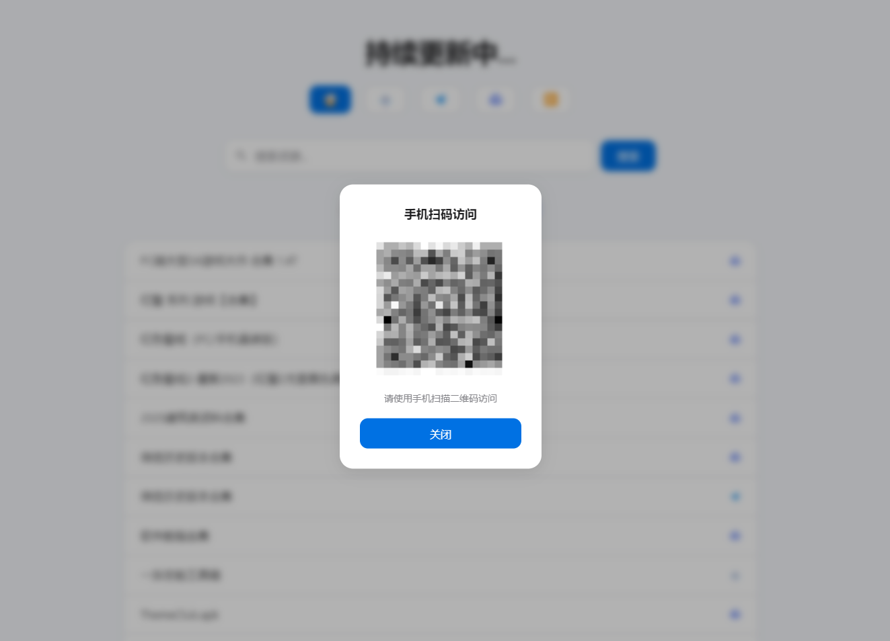

# 网盘资源管理展示系统

## 2025年2月26日 新增访问环境限制，PC强制手机扫码访问


这是一个基于PHP的资源管理系统，提供资源管理、分享和转存功能。系统集成了夸克网盘API，支持资源的自动转存和分享，后台很简陋有能力的自己优化。

## 安装说明

1. 环境要求
   - PHP 7.0+
   - SQLite3
   - PHP PDO扩展
   - PHP CURL扩展

2. 安装步骤
```bash
# 1. 复制项目文件到网站根目录

# 2. 确保以下目录可写

# 3. 修改配置文件
# 编辑 config.php，设置管理员密码和夸克网盘Cookie
```

3. 配置说明
   - ADMIN_PASSWORD：管理后台密码
   - QUARK_COOKIE：夸克网盘Cookie
   - API_KEY：API访问密钥


## API接口说明

### 1. 资源管理API (api.php)

#### 获取资源列表
- 请求方式：GET
- 参数：
  - param: 固定值为1
  - name: 搜索关键词
  - page: 页码，从1开始
- 返回格式：
```json
{
    "code": 200,
    "msg": "获取成功",
    "data": {
        "data": [...],
        "count": 总数,
        "page": 当前页码,
        "pageSize": 每页数量
    }
}
```
### 2. 资源添加API (apiadd.php)

#### 添加资源
- 请求方式：GET/POST
- 参数：
  - authorization: API密钥
  - title: 资源标题
  - cover: 资源链接
  - episodes: 集数（可选）
- 返回格式：
```json
{
    "success": true/false,
    "data": null,
    "message": "操作结果说明"
}
```

#### 直接链接请求示例：

# GET方式添加资源
```
https://你的域名/apiadd.php?authorization=API密钥&title=视频标题&cover=https://pan.quark.cn/s/3f5c2c7c8d9e&episodes=20
```
# 返回结果示例
```
{
    "success": true,
    "data": null,
    "message": "数据添加成功"
}
```

### 3. 夸克网盘API (quark.php)
- 配置第535行的站点域名与密钥
#### 资源转存
- 请求方式：GET
- 参数：
  - action: "save"
  - url: 分享链接
  - folder: 目标文件夹ID（可选）
  - title: 自定义标题（可选）
- 返回格式：
```json
{
    "code": 0,
    "msg": "转存结果",
    "data": {
        "taskId": "任务ID",
        "newFileIds": [...],
        "shareLink": "新的分享链接"
    }
}
```

#### 直接链接请求示例：

# 转存文件
```
https://你的域名/quark.php?action=save&url=https://pan.quark.cn/s/3f5c2c7c8d9e&title=自定义标题
```
# 查询任务状态
```
https://你的域名/quark.php?action=status&taskId=12345678
```
# 转存成功返回示例
```
{
    "code": 0,
    "msg": "转存成功",
    "data": {
        "taskId": "12345678",
        "newFileIds": ["fid1", "fid2"],
        "shareLink": "https://pan.quark.cn/s/newsharelink"
    }
}
```
# 任务状态返回示例
```
{
    "code": 0,
    "msg": "获取任务状态成功",
    "data": {
        "status": 2,
        "progress": 100,
        "message": "任务完成"
    }
}
```
## 注意事项

1. Cookie有效期
   - 夸克网盘Cookie有效期有限，需要定期更新
   - Cookie失效会导致转存功能不可用

2. 数据备份
   - 建议定期备份SQLite数据库文件
   - 可以使用导出功能备份数据

[QuarkPanTool](https://github.com/ihmily/QuarkPanTool) 夸克转存使用QuarkPanTool改


## 免责声明：本工具仅供学习和研究使用，请勿用于非法目的。由使用本工具引起的任何法律责任，与本工具作者无关。
